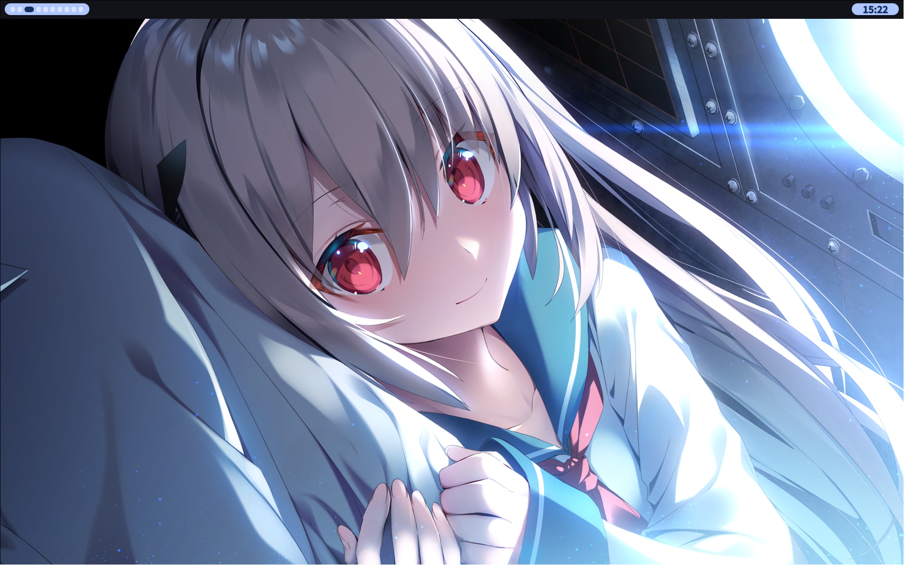
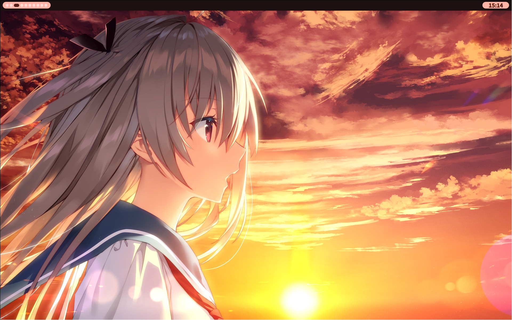

# minearchive/dotfiles

NixOS + Home Manager dotfiles with a Material Design 3 desktop environment.

| blue | red |
|---|---|
|  |  |

## Stack

- **Hyprland** — Wayland compositor
- **QuickShell** — Custom QML shell (topbar, app launcher, notifications)
- **Matugen** — Material Design 3 dynamic color theming from wallpaper
- **swww** — Wallpaper daemon
- **fcitx5-mozc** — Japanese IME
- **spicetify-nix** — Spotify theming

## Hosts

| Name | Hardware |
|------|----------|
| `msiLaptop` | Intel GPU laptop |
| `desktop` | NVIDIA GPU desktop (Secure Boot via lanzaboote) |
| `wsl` | Windows Subsystem for Linux |

## Profiles

| Name | Description |
|------|-------------|
| `material` | Full desktop (Hyprland + QuickShell + dev tools) |
| `pastel` | Alternative theme |
| `wsl` | Minimal CLI (fish + claude-code) |

## Setup

```sh
git clone https://github.com/minearchive/dotfiles.git ~/.dotfiles
cd ~/.dotfiles
```

**System:**
```sh
sudo nixos-rebuild switch --flake .#msiLaptop  # or desktop / wsl
```

**Home Manager:**
```sh
home-manager switch --flake .#material  # or pastel / wsl
```

## License

MIT
